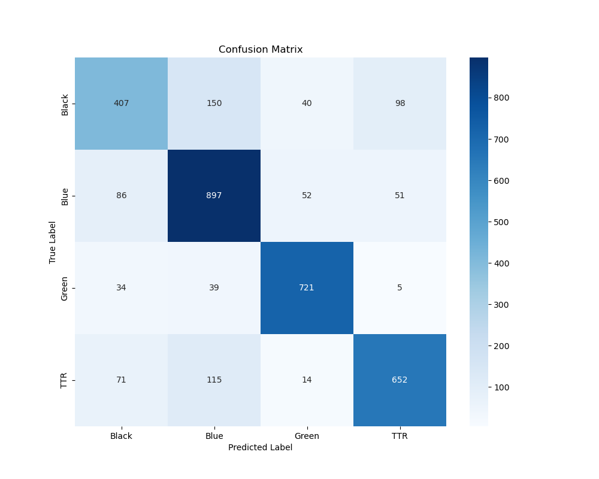

# Garbage Classification with Image and Text Features

This project implements a multimodal deep learning model that classifies garbage images by combining visual features with textual information extracted from image filenames. In this updated version, the model uses ResNet50 for image feature extraction and DistilBERT for processing textual data. A custom fusion network integrates both modalities to perform classification.

## Team members
- Rick Zhang
- Bo Zheng Ma
- Cory Wu
- Warisa Khaophong 

## General Workflow

1. **Obtain the Dataset:**  
   Download the datasets from the provided remote server. The dataset size is approximately 15GB.

2. **Run the Pipeline:**  
   Execute the consolidated script `final.ipynb` to train and evaluate the model. This script:
   - Loads training, validation, and test data.
   - Trains the model, saving the best weights as `final_resnet_adamW_model.pth`.
   - Evaluates the model on the test set, reporting overall accuracy, per-class accuracy, and displaying a confusion matrix.

## Directory Structure

Your working directory should resemble the following:

### Expected Directory Structure
```
.
├── work file      (Previous work we've done)
├── CVPR_2024_dataset_Test
├── CVPR_2024_dataset_Train
├── CVPR_2024_dataset_Val
├── final.py       (Final file to run)
├── image_and_text_dataset.py      (Extracts textual information from filenames and tokenizes the text with DistilBERT)
├── pycache
└── final_resnet_adamW_model.pth    (Generated after running final.py)
```
## Installation and Dependencies

Ensure you have the following prerequisites installed:

- Python 3.x
- PyTorch
- Transformers
- torchvision
- scikit-learn
- seaborn
- matplotlib

Install the required packages using:

```bash
pip install torch torchvision transformers scikit-learn seaborn matplotlib
```
## Dataset Structure

Place the following in the project root:
- CVPR_2024_dataset_Train
- CVPR_2024_dataset_Val
- CVPR_2024_dataset_Test

## Usage
1. **Update Dataset Paths**:
Modify the dataset paths in final.ipynb to point to your local or remote dataset location.
2.	**Run the Script**:
Execute the following command to start the training and evaluation process:
```python final.ipynb```
The script automatically detects and utilizes GPU, MPS (for Apple Silicon), or CPU based on availability.


## Model Details
- Image Features: ResNet50
- Text Features: DistilBERT (text is extracted from image filenames)
- Fusion Layers: Custom fully connected layers fuse a 512-dimensional image representation with a 512-dimensional text representation for final classification.
- Training: Uses the AdamW optimizer (learning rate = 2e-5, weight decay = 0.01) over 8 epochs.
- Evaluation: Computes overall accuracy, per-class accuracy, and displays a confusion matrix.

## Running on TALC
1.	**Transfer Files**:
Copy final.py and image_and_text_dataset.py to TALC.
2.	**Update Dataset Path**:
In final.py, update the dataset path to:
```/work/TALC/enel645_2025w/garbage_data```
3.	**Create SLURM Job Files**:
Prepare a .slurm file to run final.ipynb.
4.	**Execute**:
Run the job to train the model and generate results with final_resnet_adamW_model.pth.

## Results
After training and evaluation on the test set, the model achieved an overall accuracy of approximately 78.00%. Detailed per-class performance is as follows:
- Black: 58.56%
- Blue: 82.60%
- Green: 90.24%
- TTR: 76.53%



## Additional Notes
- Dataset and Weights:
The large dataset files and pretrained model weights are not included in the repository. Please obtain them from the provided remote server.
- Dataset Module:
The file image_and_text_dataset.py defines a custom PyTorch dataset. It loads images using torchvision.datasets.ImageFolder and processes filenames to extract textual information via the DistilBERT tokenizer. Each sample includes the image, tokenized text (input IDs and attention mask), and the label.
- Pipeline Integration:
The script final.py consolidates both training and testing routines. It outputs evaluation metrics including overall test accuracy, per-class accuracy, and a visual confusion matrix.

